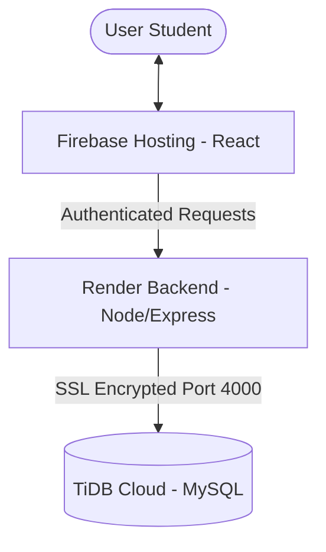

# Milestone 2 Report

**Project**: Course Advising System
**Student name**: [YOUR NAME HERE]
**Student UIN**: [YOUR UIN HERE]

All sections are mandatory. Please do not change the format of this template.

## 1. Overview (10 points)
This website is a **Course Advising System** designed to help university students manage their course planning and tracking. It allows students to view their advising history, submit new course plans for upcoming terms, and keep track of their approval status.

### Technologies Used:
- **Frontend**: React.js with Vite, hosted on **Firebase Hosting**.
- **Backend**: Node.js with **Express.js**, deployed on **Render**.
- **Database**: **TiDB Cloud (MySQL-Compatible)** for managed cloud storage.
- **Security**: JWT (JSON Web Tokens) and **SSL/TLS** for encrypted database connections (RejectUnauthorized: false).
- **Deployment**: Automatic CI/CD via GitHub integration with Render and manual Firebase CLI deployment.

### Implementation Status:
| Feature | Implemented | Description |
|---------|-------------|-------------|
| User Auth (Milestone 1) | Yes | Login/Logout with JWT and Email OTP Verification |
| Advising History | Yes | Table view with Status, Date, Term |
| New Advising Form | Yes | Dual-section form (History & Plan) |
| Dynamic Rows | Yes | Add/Remove rows in the course plan |
| Course Dropdown | Yes | Pre-populated from a managed list |
| Duplicate Prevention | Yes | Filters out already-taken/pending courses |
| GPA Validation | Yes | Strict 0.0 - 4.0 validation |
| Status Freezing | Yes | Approved/Rejected records are read-only |

### Live Application Links:

- **Frontend (Firebase)**: https://cs418-tony.web.app
- **Backend (Render API)**: https://cs418518-s26-vra1.onrender.com

---

## 2. Milestone Accomplishments (10 points)
All specifications for Milestone 2 have been successfully fulfilled.

### Table 1: Status of milestone specifications
| Fulfilled | Feature# | Specification |
|-----------|----------|---------------|
| Yes | 1 | Menu specifically for course advising after login |
| Yes | 2 | Advising History form (Date, Term, Status) |
| Yes | 3 | New Course Advising form with History and Plan sections |
| Yes | 4 | Header section (Last Term, Last GPA, Current Term) |
| Yes | 5 | Course name dropdown list filtering taken courses |
| Yes | 6 | Ability to add multiple rows for the course plan |
| Yes | 7 | Pre-populated form for existing records |
| Yes | 8 | Read-only mode for Approved or Rejected records |
| Yes | 9 | Support for Status (Pending, Approved, Rejected) |
| Yes | 10 | Security mapping (user-specific records in database) |

---

## 3. Architecture (20 points)
The project follows a cloud-native **3-Tier Architecture**:

### Core Components:
1. **Frontend (Presentation)**: Built with **React** and hosted on **Firebase**. It uses secure environment variables to communicate with the production API.
2. **Backend (App Logic)**: Built with **Node.js** and **Express**, deployed on **Render**. It handles data validation, business rules, and secure database pooling.
3. **Database (Data Layer)**: **TiDB Cloud** provides a distributed MySQL-compatible database with SSL encryption enabled for all connections.

### Architecture Diagram:

---

## 4. Database Design (20 points)
The database was expanded in Milestone 2 to include tables for record tracking, course catalogs, and OTP security.

### Table 2: `advising_records` Fields
| Field | Type | Key | Example |
|-------|------|-----|---------|
| id | INT | Primary | 1 |
| u_id | INT | Foreign | 1 |
| last_term | VARCHAR(50) | - | Fall 2023 |
| last_gpa | DECIMAL(3,2) | - | 3.50 |
| advising_term | VARCHAR(50) | - | Spring 2024 |
| status | ENUM | - | Pending |

### Table 3: `user_info` (Security)
| Field | Type | Key | Example |
|-------|------|-----|---------|
| u_id | INT | Primary | 1 |
| u_email | VARCHAR(50) | Unique | narif@odu.edu |
| u_password | VARCHAR(150) | - | (Hashed Password) |
| u_is_verified | INT | - | 1 |

### Table 4: `email_otp` (Verification)
| Field | Type | Key | Example |
|-------|------|-----|---------|
| id | INT | Primary | 5 |
| email | VARCHAR(255) | Unique | user@example.com |
| otp | VARCHAR(10) | - | 140533 |
| expires_at | DATETIME | - | 2024-03-31 18:00:00 |

---

## 5. Implementation (40 points)
The following describes how the key specifications were implemented and where to find the source code.

### 1. Cloud Database Integration (TiDB):
Configured the backend to use an SSL-encrypted connection to TiDB Cloud. Environment variables (`DB_HOST`, `DB_USER`, `DB_PASSWORD`, `DB_NAME`) were moved to Render's secret management for security. Hardcoded credentials were removed from the source code.
- **Code Location**: [connection.js](file:cs418518-s26/Project/server/database/connection.js)

### 2. Smart Course Selection & Filtering:
The course dropdown in the form is filtered in real-time. Before populating the list, the frontend calls the `/taken-courses` endpoint, which checks both the established history table and any non-rejected plans to prevent duplicate registrations.
- **Code Location**: [AdvisingForm.jsx](file:cs418518-s26/Project/client/src/AdvisingForm.jsx) and [advising.js](file:cs418518-s26/Project/server/route/advising.js)

### 3. Registration & OTP Flow:
Implemented a secure registration process using an `email_otp` table to verify users before allowing them to access the advising system. This included setting up an SMTP transporter for real-world verification.
- **Code Location**: [user.js](file:cs418518-s26/Project/server/route/user.js)

### 4. Form Freezing (Read-only status):
A conditional `isFrozen` state is calculated based on the fetched status from the database. If `status === 'Approved'` or `'Rejected'`, all inputs and buttons are automatically disabled using React state binding to ensure data integrity.
- **Code Location**: [AdvisingForm.jsx](file:cs418518-s26/Project/client/src/AdvisingForm.jsx) 

### 5. Multi-Row Submission (Transactions):
To ensure that a header and its course list are saved together, the backend uses a database **Transaction**. All courses are mapped and saved after obtaining the `insertId` of the header record. If any part fails, the entire request is rolled back.
- **Code Location**: [advising.js](file:cs418518-s26/Project/server/route/advising.js)
