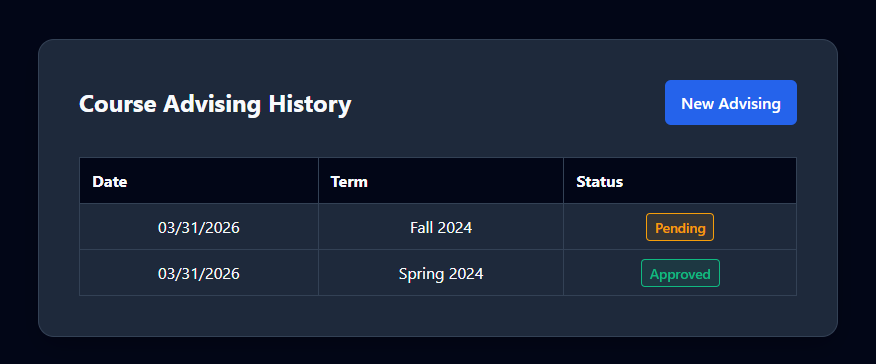
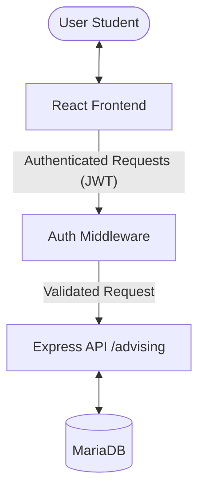

# Milestone 2 Report

**Project**: Course Advising System
**Student name**: [YOUR NAME HERE]
**Student UIN**: [YOUR UIN HERE]

All sections are mandatory. Please do not change the format of this template.

## 1. Overview (10 points)
This website is a **Course Advising System** designed to help university students manage their course planning and tracking. It allows students to view their advising history, submit new course plans for upcoming terms, and keep track of their approval status.

### Technologies Used:
- **Frontend**: React.js with Vite for a fast, component-based development experience.
- **Backend**: Node.js with the **Express.js** framework for handling HTTP requests and routing.
- **Database**: MariaDB/MySQL for persistent data storage.
- **Authentication**: JWT (JSON Web Tokens) to ensure that students can only access their own records.

### Implementation Status:
| Feature | Implemented | Description |
|---------|-------------|-------------|
| User Auth (Milestone 1) | Yes | Login/Logout with JWT |
| Advising History | Yes | Table view with Status, Date, Term |
| New Advising Form | Yes | Dual-section form (History & Plan) |
| Dynamic Rows | Yes | Add/Remove rows in the course plan |
| Course Dropdown | Yes | Pre-populated from a managed list |
| Duplicate Prevention | Yes | Filters out already-taken/pending courses |
| GPA Validation | Yes | Strict 0.0 - 4.0 validation |
| Status Freezing | Yes | Approved/Rejected records are read-only |

### Working Page Screenshot:

---

## 2. Milestone Accomplishments (10 points)
All specifications for Milestone 2 have been successfully fulfilled.

### Table 1: Status of milestone specifications
| Fulfilled | Feature# | Specification |
|-----------|----------|---------------|
| Yes | 1 | Menu specifically for course advising after login |
| Yes | 2 | Advising History form (Date, Term, Status) |
| Yes | 3 | New Course Advising form with History and Plan sections |
| Yes | 4 | Header section (Last Term, Last GPA, Current Term) |
| Yes | 5 | Course name dropdown list filtering taken courses |
| Yes | 6 | Ability to add multiple rows for the course plan |
| Yes | 7 | Pre-populated form for existing records |
| Yes | 8 | Read-only mode for Approved or Rejected records |
| Yes | 9 | Support for Status (Pending, Approved, Rejected) |
| Yes | 10 | Security mapping (user-specific records in database) |

---

## 3. Architecture (20 points)
The project follows a classic **3-Tier Architecture**:

### Core Components:
1. **Frontend (Presentation)**: Built with **React**. Managed by components like `AdvisingHistory.jsx` and `AdvisingForm.jsx`.
2. **Backend (App Logic)**: Built with **Node.js** and **Express**. It handles data validation, business rules (like course filtering), and JWT-based security.
3. **Database (Data Layer)**: **MariaDB** stores user information, course catalogs, and advising history record by record.

### Architecture Diagram:

---

## 4. Database Design (20 points)
The database was expanded in Milestone 2 to include tables for record tracking and course catalogs.

### Table 2: `advising_records` Fields
| Field | Type | Key | Example |
|-------|------|-----|---------|
| id | INT | Primary | 1 |
| u_id | INT | Foreign | 13 |
| date | DATETIME | - | 2024-03-31 10:00:00 |
| last_term | VARCHAR(50) | - | Fall 2023 |
| last_gpa | DECIMAL(3,2) | - | 3.50 |
| advising_term | VARCHAR(50) | - | Spring 2024 |
| status | ENUM | - | Pending |

### Table 3: `advising_courses` (Child Table)
| Field | Type | Key | Example |
|-------|------|-----|---------|
| id | INT | Primary | 10 |
| advising_id | INT | Foreign | 1 |
| level | VARCHAR(50) | - | Undergraduate |
| course_name | VARCHAR(100) | - | CS418 - Web Programming |

---

## 5. Implementation (40 points)
The following describes how the key specifications were implemented and where to find the source code.

### 1. Course Advising Link & Menu:
Access was added to the main navigation bar. It conditionally renders only for authenticated users.
- **Code Location**: [Header.jsx](file:cs418518-s26/Project/client/src/Header.jsx)

### 2. Advising History Dashboard:
Implemented using an asynchronous `fetch` to the `/advising/history` endpoint. It renders a dynamic table with specific mapping for user IDs to ensure records are only visible to the owner.
- **Code Location**: [AdvisingHistory.jsx](file:cs418518-s26/Project/client/src/AdvisingHistory.jsx)

### 3. Smart Course Selection & Filtering:
The course dropdown in the form is filtered in real-time. Before populating the list, the frontend calls the `/taken-courses` endpoint, which checks both the established history table and any non-rejected plans.
- **Code Location**: [AdvisingForm.jsx](file:cs418518-s26/Project/client/src/AdvisingForm.jsx) and backend [advising.js](file:cs418518-s26/Project/server/route/advising.js)

### 4. Form Freezing (Read-only status):
A conditional `isFrozen` state is calculated based on the fetched status. If `status === 'Approved'` or `'Rejected'`, all inputs and buttons are automatically disabled using React state binding.
- **Code Location**: [AdvisingForm.jsx](file:cs418518-s26/Project/client/src/AdvisingForm.jsx) (Look for `isFrozen` variable).

### 5. Multi-Row Submission (Transactions):
To ensure that a header and its course list are saved together, the backend uses a database **Transaction**. All courses are mapped and saved after obtaining the `insertId` of the header record.
- **Code Location**: [advising.js](file:cs418518-s26/Project/server/route/advising.js) (Look for `connection.beginTransaction()`).
