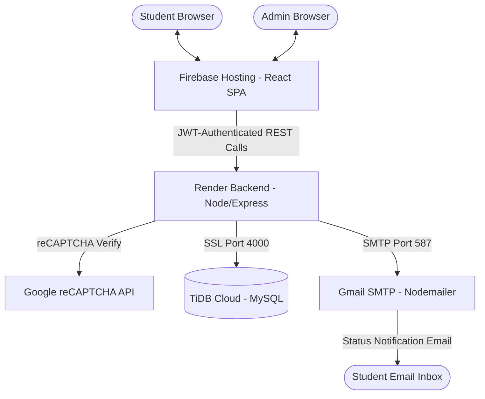

# Milestone 3 Report

**Project**: Course Advising System  
**Student name**:  Tony Cairuz
**Student UIN**:  

All sections are mandatory. Please do not change the format of this template.

---

## 1. Overview (10 points)

This milestone extends the Course Advising System with security enhancements, an Admin Portal for reviewing student submissions, and email-based status notifications. The application is deployed in a production cloud environment across three platforms.

### Technologies Used:
- **Frontend**: React.js with Vite, hosted on **Firebase Hosting** (`https://cs418-tony.web.app`)
- **Backend**: Node.js with **Express.js**, deployed on **Render** (`https://cs418518-s26-vra1.onrender.com`)
- **Database**: **TiDB Cloud (MySQL-Compatible)**, schema extended with a `feedback` column on `advising_records`
- **Security**: Google reCAPTCHA v2, `X-Frame-Options: DENY` header for clickjacking prevention, bcrypt password hashing, JWT authentication, and SSL/TLS database encryption
- **Email**: Nodemailer with Gmail SMTP for OTP and status notification delivery
- **Testing**: Jest + supertest for backend API unit testing (7 test cases across 3 test suites)

### Implementation Status:
| Feature | Implemented | Description |
|---------|-------------|-------------|
| reCAPTCHA on Login | Yes | Google reCAPTCHA v2 widget; token verified server-side |
| Clickjacking Prevention | Yes | `X-Frame-Options: DENY` + CSP `frame-ancestors 'none'` header |
| Favicon | Yes | Custom dark-theme academic icon at `/favicon.png` |
| Password Rules | Yes | Regex enforced on all password fields (FE + BE) |
| Backend Test Cases | Yes | 7 passing Jest tests across 3 suites |
| Admin Dashboard | Yes | Table view of all student advising records |
| Admin Review Form | Yes | Detail view with Approve/Reject and required feedback field |
| Status Update on Submit | Yes | `advising_records.status` updated via `PUT /advising/admin/:id` |
| Student Email Notification | Yes | Email sent to student via SMTP upon admin decision (Extra Credit) |
| Student Feedback View | Yes | Admin feedback visible in Advising History table |

### Live Application Links:
- **Frontend (Firebase)**: https://cs418-tony.web.app
- **Backend (Render API)**: https://cs418518-s26-vra1.onrender.com

---

## 2. Milestone Accomplishments (10 points)

All 10 specifications for Milestone 3 have been successfully fulfilled, including the 5-point extra credit item.

### Table 1: Status of Milestone 3 Specifications
| Fulfilled | Feature# | Specification |
|-----------|----------|---------------|
| Yes | 1 | reCAPTCHA added to login page; verified server-side before issuing JWT |
| Yes | 2 | Clickjacking prevention via HTTP response headers; demonstrated with `test-clickjacking.html` |
| Yes | 3 | Custom favicon added to the website (`/public/favicon.png`) |
| Yes | 4 | Password regex enforced on register, change-password, and reset-password in both frontend and backend |
| Yes | 5 | Jest test suite with 7 passing test cases across 3 groups |
| Yes | 6 | Admin Dashboard screen at `/admin` displaying all student advising records with Name, Term, GPA, and Status |
| Yes | 7 | Clicking a student name navigates to `/admin/:id`; admin provides required feedback and approves/rejects; redirects back to dashboard |
| Yes | 8 | `advising_records.status` and `feedback` updated atomically in TiDB upon submission |
| Yes | 9 | Student receives a formatted email notification with status and admin feedback (Extra Credit) |
| Yes | 10 | Students see updated status and admin feedback in the Course Advising History table |

---

## 3. Architecture (20 points)

The project continues with a cloud-native **3-Tier Architecture**, extended in Milestone 3 with security layers and an admin workflow.

### Architecture Diagram:


### Security Layers Added in Milestone 3:
1. **reCAPTCHA**: Frontend widget generates a one-time token per login attempt. Backend calls `https://www.google.com/recaptcha/api/siteverify` to verify before processing credentials.
2. **Clickjacking Prevention**: Express middleware sets `X-Frame-Options: DENY` and `Content-Security-Policy: frame-ancestors 'none'` on every HTTP response, preventing the app from being embedded in an `<iframe>` on a malicious site.
3. **Password Strength Rules**: All password fields now enforce a regex pattern requiring a minimum of 8 characters, at least one uppercase letter, one lowercase letter, one number, and one special character.

---

## 4. Database Design (20 points)

The `advising_records` table was extended in Milestone 3 to store admin feedback alongside the status decision.

### Table 1: `advising_records` (Extended)
| Field | Type | Key | Example |
|-------|------|-----|---------|
| id | INT | Primary | 1 |
| u_id | INT | Foreign | 8 |
| last_term | VARCHAR(50) | - | Fall 2024 |
| last_gpa | DECIMAL(3,2) | - | 3.75 |
| advising_term | VARCHAR(50) | - | Spring 2025 |
| status | ENUM | - | Approved |
| feedback | TEXT | - | All courses approved. Good luck! |
| date | DATETIME | - | 2026-04-28 06:00:00 |

### Migration Applied:
```sql
ALTER TABLE advising_records ADD COLUMN feedback TEXT DEFAULT NULL;
```

### Table 2: `user_info` (Admin Role)
| Field | Type | Key | Example |
|-------|------|-----|---------|
| u_id | INT | Primary | 8 |
| u_email | VARCHAR(255) | Unique | admin@odu.edu |
| u_is_admin | INT | - | 1 |
| u_is_verified | INT | - | 1 |
| u_2fa_enabled | INT | - | 0 |

---

## 5. Implementation (40 points)

### 1. reCAPTCHA Integration (Requirement 1)
The `react-google-recaptcha` package renders a v2 checkbox widget on the Login page. On submission, the generated token is sent in the POST body alongside credentials. The backend (`user.js`) intercepts the token and calls Google's verification API using `axios` before processing the login. If verification fails, a `400` response is returned.

- **Frontend**: `client/src/Login.jsx` — `<ReCAPTCHA>` component, token stored in state
- **Backend**: `server/route/user.js` — `axios.post` to `google.com/recaptcha/api/siteverify`

### 2. Clickjacking Prevention (Requirement 2)
An Express middleware registered at the top of `app.js` injects two HTTP headers into every response:
```
X-Frame-Options: DENY
Content-Security-Policy: frame-ancestors 'none'
```
The file `test-clickjacking.html` contains an `<iframe>` pointing at the application. Opening it in a browser shows the frame refuses to load, confirming prevention is active.

- **Code Location**: `server/app.js`
- **Proof**: `Project/test-clickjacking.html`

### 3. Favicon (Requirement 3)
A custom PNG favicon (graduation cap + open book with blue glow) was generated and placed at `client/public/favicon.png`. The `<link>` tag in `client/index.html` was updated from the default Vite SVG to reference the new file.

- **Code Location**: `client/index.html`, `client/public/favicon.png`

### 4. Password Strength Rules (Requirement 4)
A single regex constant is used across all password fields:
```js
/^(?=.*[a-z])(?=.*[A-Z])(?=.*\d)(?=.*[@$!%*?&])[A-Za-z\d@$!%*?&]{8,}$/
```
Applied on the **frontend** in `Signup.jsx` (with a hint label visible to the user) and enforced on the **backend** in `user.js` for register, change-password, and reset-password routes.

- **Code Location**: `server/route/user.js`, `client/src/Signup.jsx`

### 5. Backend Test Cases (Requirement 5)
Seven test cases organized in 3 describe blocks were written using **Jest** and **supertest**. A self-contained stub Express app is used so tests run independently of the live TiDB database.

```
Test Suite                                     Result
─────────────────────────────────────────────────────
TC1  POST /user/login — reCAPTCHA missing      ✓ PASS
TC1b POST /user/login — missing credentials    ✓ PASS
TC2  POST /user/register — weak password       ✓ PASS
TC2b POST /user/register — strong password     ✓ PASS
TC3  GET /advising/history — no token          ✓ PASS
TC3b GET /advising/history — invalid token     ✓ PASS
TC3c GET /advising/history — valid token       ✓ PASS

Test Suites: 1 passed | Tests: 7 passed | Time: 0.594s
```

- **Code Location**: `server/tests/api.test.js`
- **Run Command**: `npm test` (from `Project/server/`)

### 6. Admin Dashboard (Requirement 6)
A new page `AdminDashboard.jsx` is routed at `/admin`. It calls `GET /advising/admin/all` (admin-only, JWT-guarded) which performs a JOIN between `advising_records` and `user_info` to return all student records. Results are displayed in a table with columns: **Student Name**, **Term**, **GPA**, and **Status**. Each row is clickable.

- **Code Location**: `client/src/AdminDashboard.jsx`, `server/route/advising.js`

### 7. Admin Review Form — Approve/Reject with Feedback (Requirement 7)
Clicking a student's name navigates to `/admin/:id` (`AdminAdvisingView.jsx`). The page calls `GET /advising/admin/record/:id` to fetch the full record including courses. A textarea with a required feedback field and two styled buttons (Approve in green, Reject in red) are rendered. On submit, a `PUT /advising/admin/:id` call is made with `{ status, feedback }`. On success, the router redirects back to `/admin`.

- **Code Location**: `client/src/AdminAdvisingView.jsx`, `server/route/advising.js`

### 8. Status Update on Submission (Requirement 8)
The `PUT /advising/admin/:id` endpoint validates the admin JWT (`isAdmin: true` check), validates the status and feedback, then runs a single `UPDATE advising_records SET status = ?, feedback = ? WHERE id = ?` query against TiDB.

- **Code Location**: `server/route/advising.js` — `advising.put("/admin/:id", ...)`

### 9. Student Email Notification — Extra Credit (Requirement 9)
After the database update, the same `PUT /advising/admin/:id` endpoint calls `sendEmail()` (the existing Nodemailer SMTP helper) to send a formatted HTML email to the student's address. The email includes the decision status (color-coded) and the admin's feedback text. Since `nodemailer` is already configured with Gmail SMTP and running on Render, this works identically in both local testing and production.

- **Code Location**: `server/route/advising.js` — `sendEmail(u_email, ...)`

### 10. Student Feedback View (Requirement 10)
The `GET /advising/history` endpoint was updated to include the `feedback` column in its SELECT. The `AdvisingHistory.jsx` table was extended with a fourth column **"Admin Feedback"** that displays the feedback text when present or *"Pending review"* in italic when still null.

- **Code Location**: `client/src/AdvisingHistory.jsx`, `server/route/advising.js`
